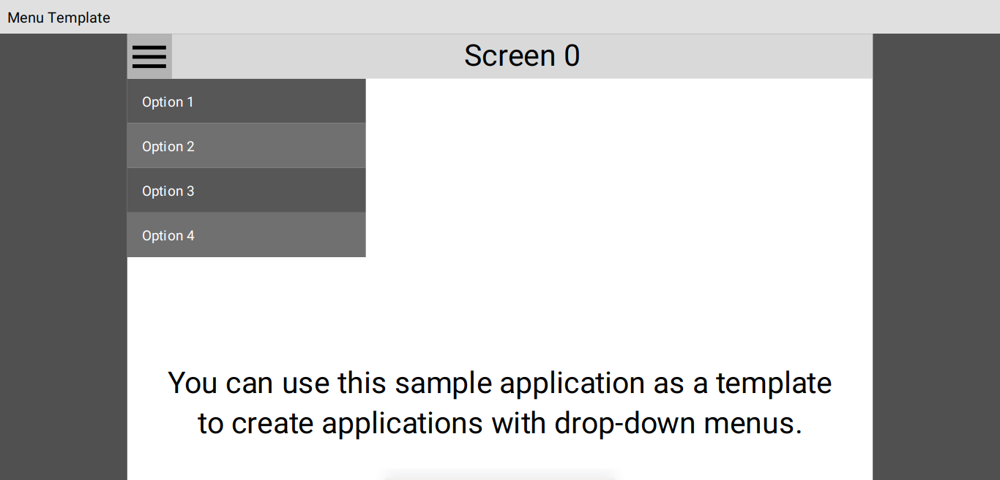

# Menu template

A template to see how the components work in Other Apps. 

With a functional and customizable drop-down menu.

- **1.xml** is the main component
- **menu.xml** is the menu component, to edit the menu open this route: **/edit/menu_template?c=menu**
- **app.xsd** is the xml validator file

## How to import
- Just copy this folder to your project directory **(PROJECT_DIR)**

This template was created with Other Apps 0.5.0, it will not work with older versions.